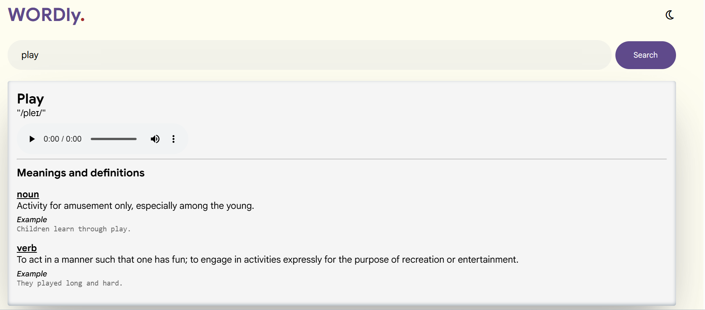
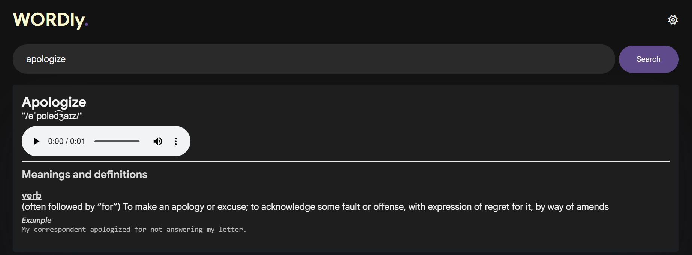

#  Wordly Dictionary SPA

A simple, responsive Single Page Application (SPA) that allows users to search for words and view their meanings, pronunciation, and examples  using a public dictionary API.

## Preview

### Light Mode

### Dark Mode

## Live Demo
https://wordly-dictionary-kappa.vercel.app/

## ✨ Features

- 🔍 Search for any English word
- 📚 View definitions for noun and verb forms
- 🔊 Listen to word pronunciation (audio support)
- 🌙 Dark mode with saved user preference (localStorage)
- ⚠️ Error handling for invalid or missing words
- 📱 Responsive design for mobile and desktop

##  Technologies Used

- HTML5
- CSS3 (with animations and dark mode)
- JavaScript (ES6)
- Fetch API
- Free Dictionary API

## 📡 API Used

Free Dictionary API  
https://dictionaryapi.dev/

